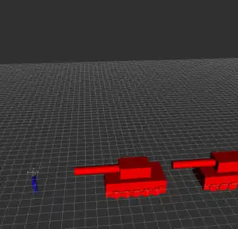

# Light weight Quadcopter drone bomber simulation 

The project is made for class assignment of robot system. 
It include some `*.urdf`, `.dae` texture with their blender python scripts(`/dae_blender_scripts`),
a simple dynamic simulation and a exciting Tiananmen scenario.

## Preview




## Install

```
git clone https://github.com/yiyuezhuo/robot_experiment.git
mv robot_experiment mydrone
cd mydrone
echo "export PYTHONPATH=\$PYTHONPATH:$(pwd)" >> ~/.bashrc
source ~/.bashrc
roslaunch mydrone display_path.launch
```
